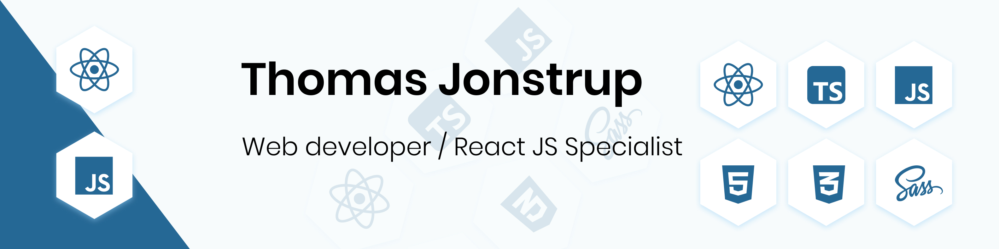

# 👋 Hi there, I'm Thomas Jonstrup

## 👨‍💻 Frontend Developer | UI/UX Enthusiast | Web Performance Optimizer

i'm Thomas from Denmark and i'm a Web Developer currently working in a Full stack developer role, i have a lot experience with UI. I have a big interest in new technlogies such as React, Node, TypeScript. I also have a big interest in design and website styling like CSS and i am always looking around the web for the latest things in regards design and website styling. I'm passionate about creating beautiful, responsive, and user-friendly web applications.

## Skills & Experience

-   💻 &nbsp; VS Code
-   ⚛️ &nbsp; | React JS | Astro JS | Svelte | Vue JS | TypeScript | HTML5 | SCSS | CSS | TailWind CSS
-   🎨 &nbsp; Figma | Adobe XD
-   🧪 &nbsp; Vitest | React Testing Library
-   📱 &nbsp; Responsive Web Design
-   🔧 &nbsp; Chrome DevTools | Lighthouse

## Skills & Technologies

<!--### Code

### Design

### Tools

--->

## Stats

### Github stats

### Streak stats

### Languages

## 📫 Let's Connect!

Feel free to reach out if you want to collaborate on a project or just chat about frontend development!

---
